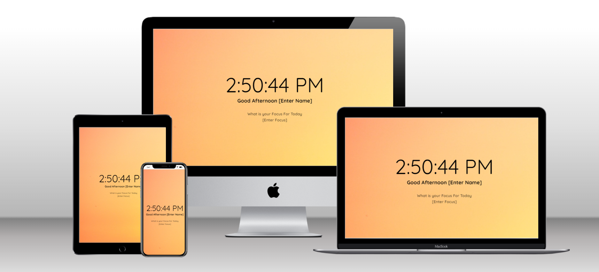

# Dynamic_Landing_Page

> Synamic Landing Page

It's a dynamic landing page built in JS, HTML &amp; CSS3.

## Built With

- Major languages
  - Javascript
  - Css

- Frameworks
  - React 

- Technologies used
  - github
  - npm

## [Live Demo](https://dynamic-landing-page-ruby.vercel.app/)

## Getting Started

### Setup

#### To get a local copy up and running follow these simple example steps.

- Click on the `Code` button on the repo
- In your local PC, open your terminal in the folder you would like to clone the project.
- Clone the repo with the command: `git clone (copied link)`; like so: `git clone https://github.com/Fatima-hub333/Airbnb-React-Project.git`
- On the terminal, navigate into the directory like so: `cd bookstore`
- Checkout to branch name like so: `git checkout [branch name]`
- Run `npm i` or `yarn` to install the dependencies
- Run `npm start` or `yarn start` to start the application

## Authors

👤 **Fatima Zahir**

- GitHub: [@githubhandle](https://github.com/Fatima-hub333)
- Twitter: [@twitterhandle](https://twitter.com/Fatima_developr)
- LinkedIn: [LinkedIn](https://www.linkedin.com/in/fatimaa-zahir/)

## 🤝 Contributing

Contributions, issues, and feature requests are welcome!

Feel free to check the [issues page](https://github.com/Fatima-hub333/Airbnb-React-Project/issues).

## Show your support

Give a ⭐️ if you like this project!

## Acknowledgments

- **Facebook** for making such a wonderful framework
- **Microverse** : for the opportunity to be part of a global network

## 📝 License

This project is [MIT](./MIT.md) licensed.
